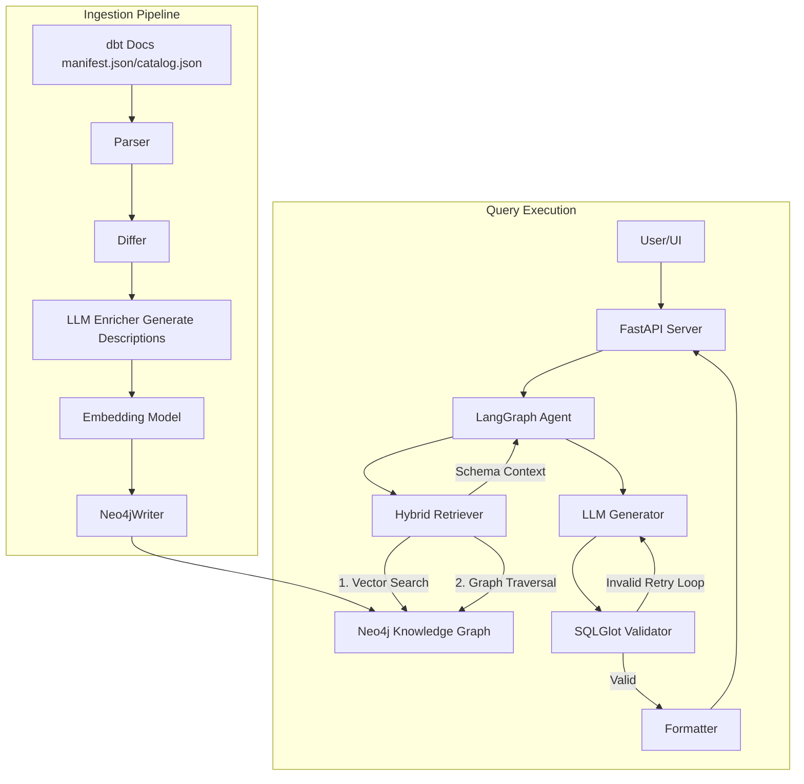
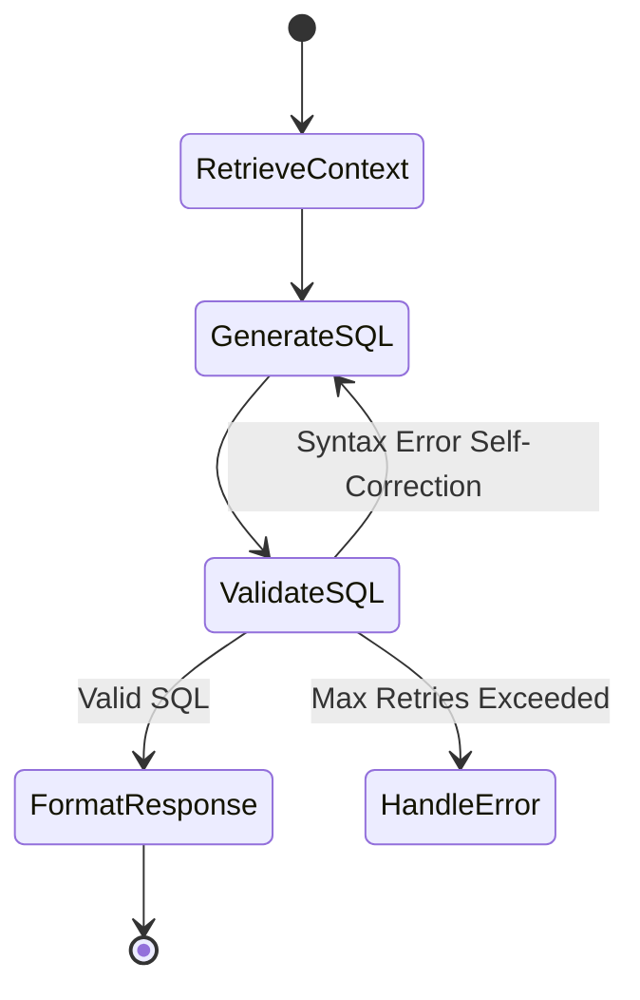

# Architecture Overview: Text-to-SQL GraphRAG

This document outlines the architecture and design decisions behind the Text-to-SQL GraphRAG system. The system maps natural language questions to accurate SQL queries by grounding Large Language Models (LLMs) in a rich, semantic knowledge graph of the data warehouse schema.

## System Architecture

The project is divided into four main functional blocks:

1. **Ingestion Pipeline** (dbt -> Metadata -> Knowledge Graph)
2. **Retrieval System** (Hybrid Vector + Graph Search)
3. **Generative Agent** (LangGraph Orchestration + Self-Correction)
4. **User Interface & API** (FastAPI + Streamlit)

## 1. Knowledge Graph Representation (Neo4j)

Instead of passing a flat list of tables directly to the LLM (which exceeds context windows and loses structural meaning), we map the data warehouse to a Neo4j Knowledge Graph.

*   **Nodes**: Table, Column, Schema, Database
*   **Relationships**: CONTAINS_SCHEMA, CONTAINS_TABLE, HAS_COLUMN, DEPENDS_ON (Lineage), FK_REFERENCES (Foreign Keys).
*   **Vector Indexes**: `table_desc_embedding` and `column_desc_embedding` store semantic vectors of the LLM-enriched descriptions.

## 2. Ingestion Pipeline

1.  **Parse**: Reads manifest.json and catalog.json from dbt.
2.  **Diff**: Compares newly parsed state against the existing Neo4j graph using content hashing.
3.  **Enrich**: For new missing tables/columns, Gemini extracts business context from the name and type.
4.  **Embed**: Converts descriptions into vectors. Batching prevents API quota exhaustion.
5.  **Write**: Upserts the unified graph into Neo4j using bulk UNWIND Cypher queries.

## 3. Hybrid Retrieval (GraphRAG)

Standard RAG (Vector Search only) fails in databases because finding "revenue" matches a column, but misses the fact that users must be joined to sessions. The retriever solves this:

1.  **Vector Search**: Finds the highly semantically relevant "seed" nodes.
2.  **Graph Traversal**: Explores 1-2 hops outward from the seeds along DEPENDS_ON or foreign key edges.
3.  **Assembly**: Serializes the resulting sub-graph (Tables + Columns + Relationships) into a clean format.

## 4. LangGraph Agent (Generation & Validation)

*   **Generation**: System prompts actively specify the requested target dialect (e.g., Postgres).
*   **Validation**: Utilizes sqlglot to parse the generated SQL offline ensuring grammatical correctness.
*   **Self-Correction**: If sqlglot spots an invalid query, the Agent feeds the error back to the LLM autonomously (up to 3 times).

## 5. Knowledge Graph Extensibility

A defining advantage of this architecture is the profound extensibility of the semantic knowledge graph. Because schema relationships, metrics logic, and documentation exist uniformly as graph nodes and relationships—decoupled from the core execution engine—the knowledge base can be easily expanded in the future without systemic re-writes. 

This enables robust continuous enrichment of the semantic layer:
* **Business Glossary Linkage**: Linking raw database `Column` nodes directly to standardized overarching `BusinessTerm` nodes to unify reporting dialects.
* **Query Caching & Few-Shot Injection**: Saving high-value, human-validated SQL queries as `VerifiedQuery` nodes linked directly to the `Table` nodes they query. The retriever can dynamically identify semantically similar `VerifiedQuery` patterns to inject as perfect few-shot examples for the LLM.
* **Automated Complex Problem Solving**: By expanding the semantics (e.g., hooking into data quality rule results, access constraints, or pipeline orchestration status nodes), the LangGraph agent can perform multi-hop, automated problem solving. It allows the system to identify not just *how* to write a SQL query, but autonomously determine if the underlying data is fresh or reliable enough to answer the user accurately before executing.

## 5. Knowledge Graph Extensibility

A defining advantage of this architecture is the profound extensibility of the semantic knowledge graph. Because schema relationships, metrics logic, and documentation exist uniformly as graph nodes and relationships—decoupled from the core execution engine—the knowledge base can be easily expanded in the future without systemic re-writes. 

This enables robust continuous enrichment of the semantic layer:
* **Business Glossary Linkage**: Linking raw database \Column\ nodes directly to standardized overarching \BusinessTerm\ nodes to unify reporting dialects.
* **Query Caching & Few-Shot Injection**: Saving high-value, human-validated SQL queries as \VerifiedQuery\ nodes linked directly to the \Table\ nodes they query. The retriever can dynamically identify semantically similar \VerifiedQuery\ patterns to inject as perfect few-shot examples for the LLM.
* **Automated Complex Problem Solving**: By expanding the semantics (e.g., hooking into data quality rule results, access constraints, or pipeline orchestration status nodes), the LangGraph agent can perform multi-hop, automated problem solving. It allows the system to identify not just *how* to write a SQL query, but autonomously determine if the underlying data is fresh or reliable enough to answer the user accurately before executing.
